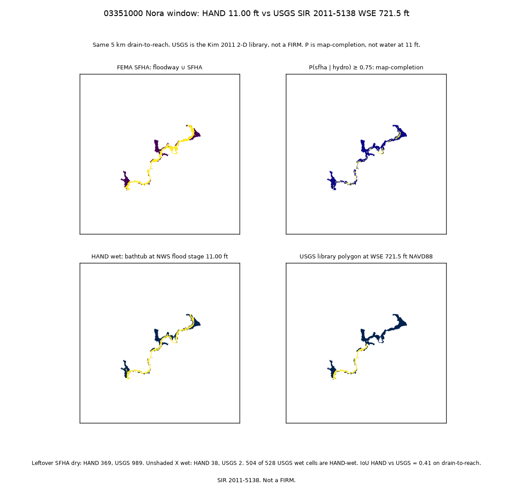
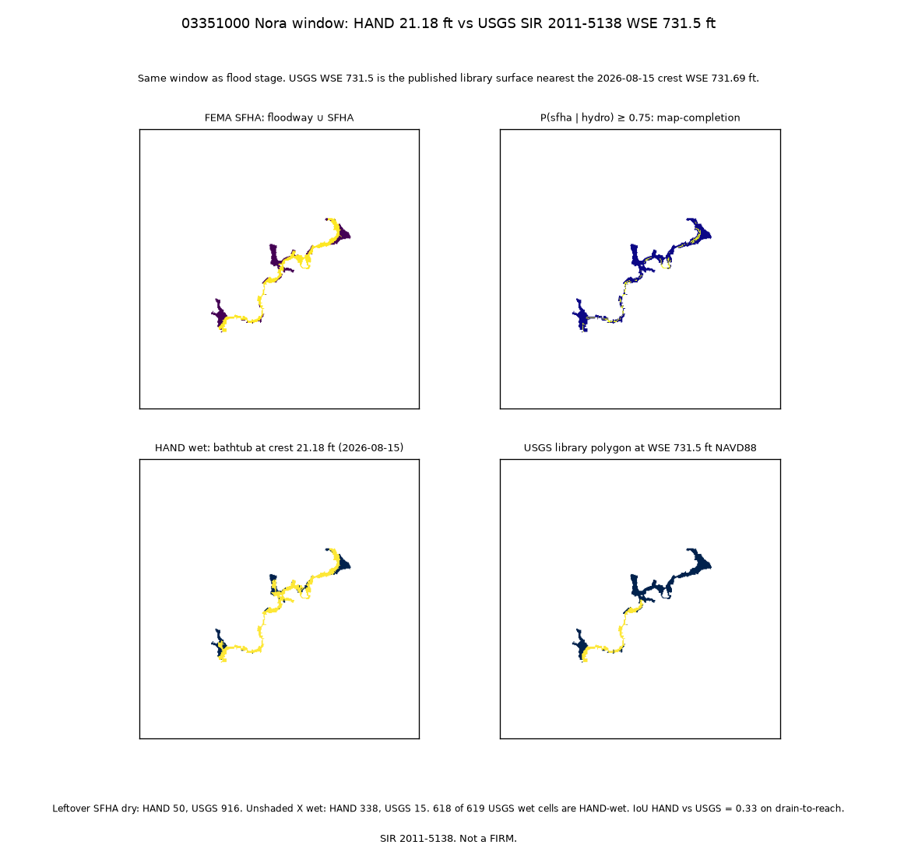

# White River FIM compare (Nora)

At flood stage, **504 of 528** USGS library-wet cells on this window are already HAND-wet (**24 miss**). At the 21.18 ft crest, **618 of 619** (**1 miss**). That is the same neighborhood. IoU 0.41 / 0.33 is what you get when HAND is a superset and the Nora window still includes upstream cells the 2011 library never mapped.

USGS wet is 528 / 619 against HAND 1197 / 1876. Leftover SFHA stays dry on USGS (989 / 916). HAND fills leftover SFHA (dry 369 to 50) and extra unshaded X (38 to 338). USGS barely touches Zone X (2 to 15). The library is the tight 2-D map on this clip.

Four layers, one 5 km window at USGS **03351000** / NWS **NORI3**. FEMA SFHA and calibrated `P(sfha | hydro) ≥ 0.75` from the map-completion sibling. HAND wet at **11.00 ft** and **21.18 ft** from the Nora stage tree. USGS is the Kim 2011 FaSTMECH library (SIR **2011-5138**), NWS partner FIM polygons at WSE **721.5 ft** and **731.5 ft** NAVD88, nearest published surfaces to those HAND stages.

`P(sfha | hydro)` is a map-completion layer, not water at 11 ft and not water at 21.18 ft. The HAND mask is a 30 m bathtub. The USGS polygon is not a FIRM.

NWS 710.52 vs Nora 710.51 is noise. Scores are drain-to-reach only. Siblings frozen. No interpolated USGS surface. No downtown Indianapolis library. Same window as https://github.com/martialsystems/white_river_stage_inundation.

| Quantity | Flood 11.00 ft / USGS 721.5 | Crest 21.18 ft / USGS 731.5 |
|----------|----------------------------:|----------------------------:|
| USGS wet also HAND | 504 of 528 | 618 of 619 |
| USGS wet not HAND (miss) | 24 | 1 |
| HAND wet | 1197 | 1876 |
| USGS wet | 528 | 619 |
| IoU HAND vs USGS | 0.41 | 0.33 |
| SFHA dry on HAND | 369 | 50 |
| SFHA dry on USGS | 989 | 916 |
| Unshaded X wet HAND | 38 | 338 |
| Unshaded X wet USGS | 2 | 15 |



Figure 1. Four layers at NWS flood stage 11.00 ft and the nearest published USGS library surface (WSE 721.5 ft).

- SFHA: mapped floodway ∪ SFHA on the window.
- P ≥ 0.75: sibling map-completion, not water at 11 ft.
- HAND wet: bathtub at 11.00 ft.
- USGS: SIR 2011-5138 polygon at WSE 721.5 ft. 504 of 528 USGS-wet cells are HAND-wet (24 miss).



Figure 2. Same four layers at the 2026-08-15 crest 21.18 ft and USGS WSE 731.5 ft.

- Containment: 618 of 619 USGS-wet cells are HAND-wet (1 miss). Flood-stage miss is 24 of 528.
- HAND fills leftover SFHA (dry 369 to 50) and extra unshaded X (38 to 338). USGS Zone X is 2 to 15.
- IoU 0.41 / 0.33 is in the lead paragraph with the superset and upstream-window reason.

Live rasters, the NWS shapefile zip, and `*.tif` stay gitignored; `logs/nora_live/four_wet.png` and `logs/nora_live/four_wet_crest_2026-08-15.png` are the committed figures.

Related trees:

- https://github.com/martialsystems/indiana_flood_completion (HUC-8 05120201 map completion; same HAND grid)
- https://github.com/martialsystems/white_river_stage_inundation (Nora HAND bathtub at 11.00 ft and 21.18 ft)
- Three-tree summary: https://gist.github.com/martialsystems/16584e78d079666f7e8994b4cc6158be

Limitations:

- 30 m HAND vs a 10 m FaSTMECH polygon, clipped to the Nora window, not the full 11-mile library reach.
- Crest 21.18 ft is NWS provisional; nearest published library WSE is 731.5 ft.
- IoU is on the full Nora drain-to-reach window, not drain-to-reach intersect library-domain. Containment is the neighborhood number.
- One gage, two library surfaces. No third model, no whole HUC, no climate.

| File | Role |
|------|------|
| [METHODOLOGY.md](METHODOLOGY.md) | Locked contract |
| [AGENTS.md](AGENTS.md) | Agent rules |
| [CHECKLIST.md](CHECKLIST.md) | Operator list |
| `src/fimcompare/` | Stage pin, rasterize, IoU, claims |
| `fimforge/` | GraphForge pin |

## Stage 0

```bash
python3.12 -m venv .venv
source .venv/bin/activate
pip install -r requirements.txt
PYTHONPATH=src:. python3 scripts/run_fixture.py logs/stage0_fixture
.venv/bin/python -m pytest tests -q
```

Hard gate: fixture IoU is on drain-to-reach, claim scan clean, product laws allow Stage 0. See METHODOLOGY.md.

Live (sibling rasters on disk, NWS zip fetched to `data/raw`):

```bash
PYTHONPATH=src:. python3 scripts/run_live.py logs/nora_live
```
